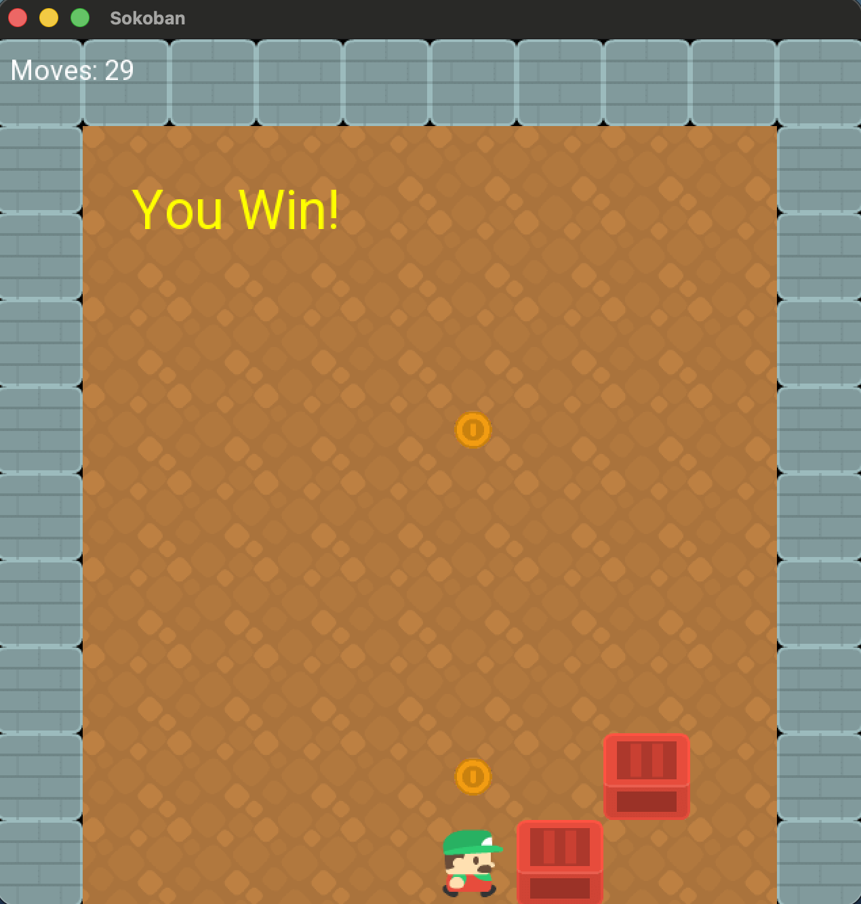

# Sokoban Game

A modern C++ implementation of the classic Sokoban puzzle game built with SFML. The project features object-oriented game design, custom level parsing, animated movement, undo/redo functionality, sound effects, and additional gameplay mechanics including teleporters.



---

## Features

- Grid-based Sokoban gameplay
- Custom level loading from `.lvl` files
- SFML rendering using a sprite tilesheet
- Player movement and collision handling
- Box pushing mechanics
- Win condition detection
- Move counter
- Undo / Redo system
- Directional player animations
- Victory sound effects
- Teleporter gameplay mechanic
- Dynamic window sizing based on level dimensions
- Unit testing with Boost.Test

---

## Technologies Used

- C++
- SFML 3
- Boost.Test
- Object-Oriented Programming
- STL Containers & Algorithms

---

## Controls

| Key | Action |
|---|---|
| W / ↑ | Move Up |
| S / ↓ | Move Down |
| A / ← | Move Left |
| D / → | Move Right |
| R | Reset Level |
| Z | Undo Move |
| Y | Redo Move |
| ESC | Exit Game |

---

## Project Structure

```text
Sokoban.cpp              Core game logic and rendering
Sokoban.hpp              Class declarations and interfaces
main.cpp                 Game loop and input handling
level1.lvl               Sample level
level2.lvl               Sample level
level3.lvl               Sample level
sokoban_tilesheet.png    Game textures
win.wav                  Victory sound effect
```

---

## Gameplay Mechanics

### Collision System

The game prevents:
- walking through walls
- pushing multiple boxes simultaneously
- pushing boxes outside the map bounds

### Undo / Redo

Previous board states and player positions are stored using stacks, allowing full undo and redo functionality during gameplay.

### Teleporters

Special teleporter tiles instantly move the player between paired teleport locations when activated.

### Win Detection

The game dynamically tracks box and storage positions and detects victory once all required boxes are correctly placed.

---

## Building & Running

### Requirements

- C++17 or newer
- SFML 3
- GNU Make

### Compile

```bash
make
```

### Run

```bash
./Sokoban level1.lvl
```

---

## Testing

The project includes automated unit tests using Boost.Test for:
- player movement
- collision handling
- box pushing
- win condition validation

---

## Acknowledgements

- Kenney Sokoban Pack (CC0) for game assets
- SFML documentation and rendering resources
- Google Fonts (Roboto)
